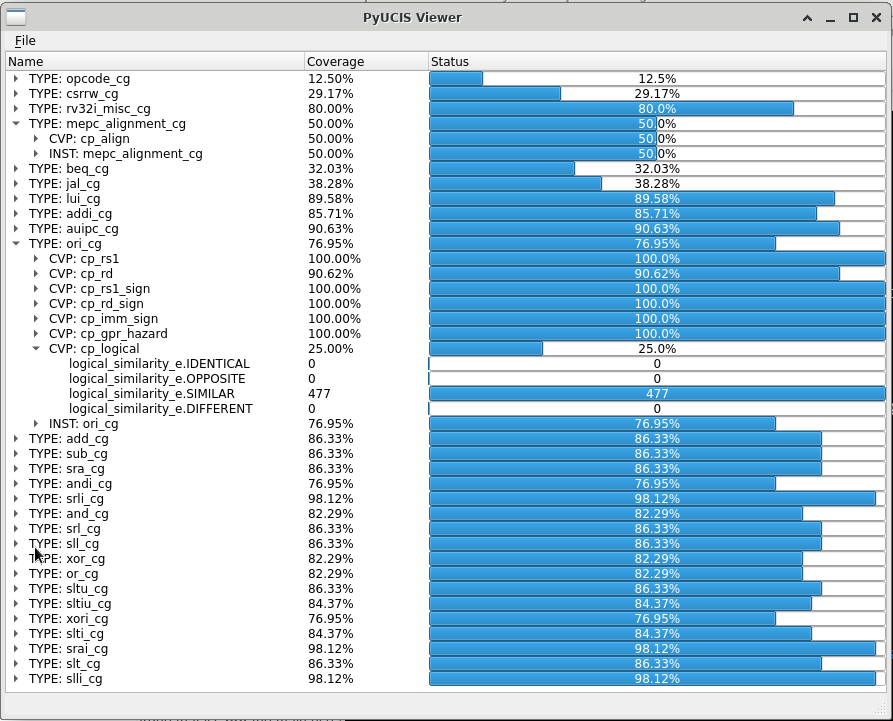
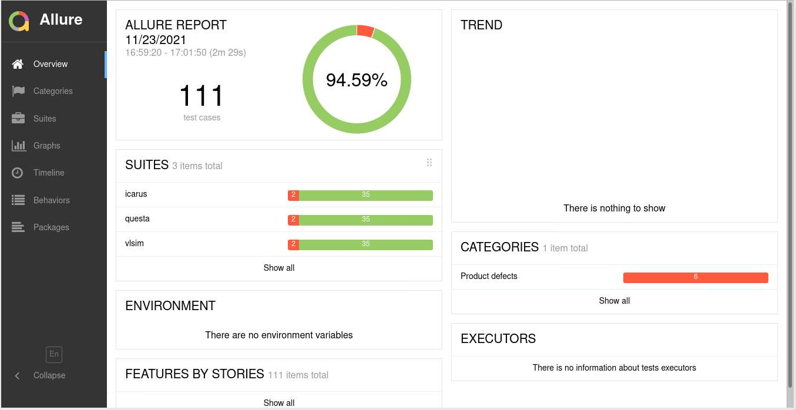
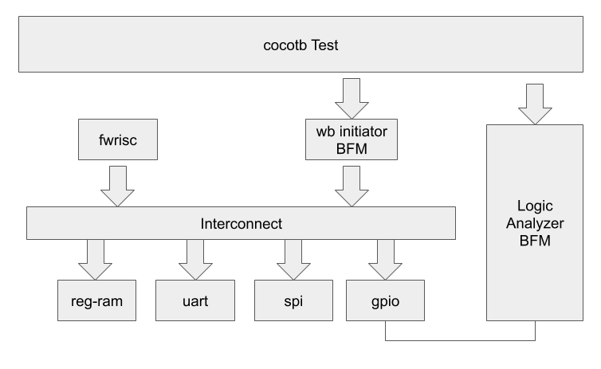
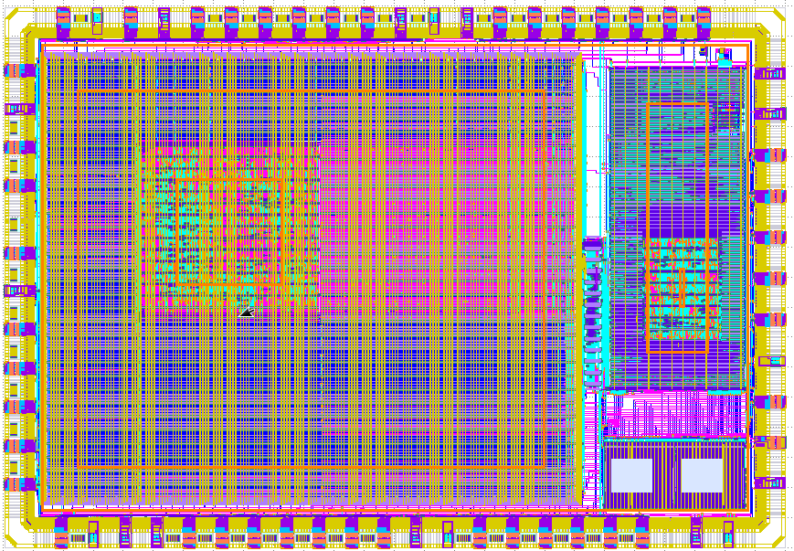

# Open-Source Projects

## Random Test Generation, Solvers, and Functional Coverage

### PyVSC - Constraints and Coverage in Python

**Stage:** Production

Python has been used for functional verification for quite 
some time. When I began using Python, one thing I missed
from SystemVerilog was access to SystemVerilog-style 
constraints and functional coverage. PyVSC provides a
Python library that supports constrained randomization
and functional coverage collection.

*Note:* PyVSC is used for constraint solving and collecting
functional coverage by the Python implementation of the
Google-developed RISCV-DV package. RISCV-DV generates 
random RISC-V test programs.

#### Resources
- [readthedocs](https://pyvsc.readthedocs.io/en/latest/)
- [github](https://github.com/fvutils/pyvsc)
- [WOSET Paper](publications/2020_WOEST_SvStyle_Constraints_Coverage_in_Python.pdf)
- [RISCV-DV](https://github.com/google/riscv-dv)

### PyUCIS

**Stage:** Production

Once collected, functional coverage data must be stored in an accessible
manner to support analysis. [Accellera UCIS](https://www.accellera.org/downloads/standards/ucis)
defines an API for storing and retrieving coverage data, as well as an
XML interchange format. 
PyUCIS is an object-oriented Python API on top of the UCIS API that can 
be used to store and access coverage data. Supported back-end implementations
include commercial tool implementations of the UCIS API, the XML 
interchange format, and an in-memory representation.

#### Resources
- [github](https://github.com/pyucis)
- [Accellera UCIS](https://www.accellera.org/downloads/standards/ucis)

### PyUCIS-Viewer

**Stage:** Beta

Interactive graphical applications make getting an intuitive sense of
coverage data simpler. PyUCIS Viewer is a Python application that 
uses the [QT](https://www.qt.io) library to render coverage data.

#### Resources
- [github](https://github.com/fvutils/pyucis-viewer)

### libvsc

**Stage:** Development

The PyVSC library uses the [Boolector](https://github.com/boolector/boolector)
SMT solver to implement SAT solving. Additional algorithms are needed to
implement iterative constraint (ie foreach) expansion, constraint partitioning, 
and uniform randomization. While Python is great as a front-end interface
for the user, it doesn't excel at high-performance computing.

libvsc is a new implementation in C++ of the core data model, 
coverage collection, and randomization algorithms. Early measurements indicate
that libvsc is roughly twice as fast as PyVSC.

#### Resources
- [github](https://github.com/fvutils/libvsc)

## Software-Driven Functional Verification

### Bare-Metal Kernel

**Stage:** Alpha/Archived

#### Resources
- [github](https://github.com/mballance/bmk)

### Zephyr-Cosim

**Stage:** Alpha

### Zephyr DV Patches

### Zephyr DTS Tools

## Featherweight-IP

### Resources
- [github](https://github.com/featherweight-ip)

## Functional Verification Infrastructure

### PyBFMs - Bus-Functional Models for Python

### TbLink RPC

### IVPM - IP and Verification Package Manager
Design and Verification IP comes from many sources. While it 
would be nice to think of reusable IP as being 'complete' and
'read-only', in practice I often find myself co-developing
projects. IVPM manages fetching project dependencies from a
variety of sources (but with a focus on Git repositories) and
creating a project-local set of package dependencies. 

#### Key Features
- Integration with SVE

#### Resources
- [github](https://github.com/fvutils/ipvm)

### MKDV - Job Runner for Functional Verification

**Stage:** Beta / Internal Production

#### Key Features
- YAML-based specification of job configurations
- Support for running parallel jobs locally or via [Slurm Workload Manager](https://slurm.schedmd.com/documentation.html)
- Integration with [Allure](https://docs.qameta.io/allure/) for reports

### Resources
- [github](https://github.com/fvutils/mkdv)

### Resources
- [github](https://github.com/pybfms)

## eFabless/Google Multi-Project Wafer (MPW)

**Stage:** Complete (Dec 2020)

Taping out a chip has been a long-term dream of mine, and 
one that seemed unlikely to be realized given the difficulty 
and expense of doing so. A few 
developments in the industry brought this dream within reach. 
First, the [OpenROAD Project](https://theopenroadproject.org/) assembled
an RTL-to-GDS flow using open-source tools. Next, Google partnered with 
[SkyWater Technology](https://www.skywatertechnology.com/) 
to release the CMOS 130nm PDK as open source, and partnered with 
[eFabless](https://efabless.com/) to run a series of 
multi-project wafer (MPW) tape-outs for open-source designs to 
validate the flow.

I participated in the first tapeout with a very simple SoC design. 
The design and testbench environment are shown below.

Learning about the tools and key considerations across the entire
process was extremely educational -- and, self-education process I
would have been unlikely to undertake as a personal project in 
the absence of an open-source toolflow.

### Resources
- [github](https://github.com/mballance/caravel_fwpayload)
- [PR](https://www.businesswire.com/news/home/20210406005366/en/First-Google-Sponsored-MPW-Shuttle-Launched-at-SkyWater-with-40-Open-Source-Community-Submitted-Designs)

## SVEditor - A SystemVerilog Eclipse Plug-in

**Stage:** Production / Archived

### Resources
- [website](https://sites.google.com/site/svedvkit)
- [github](https://github.com/sveditor/sveditor)

