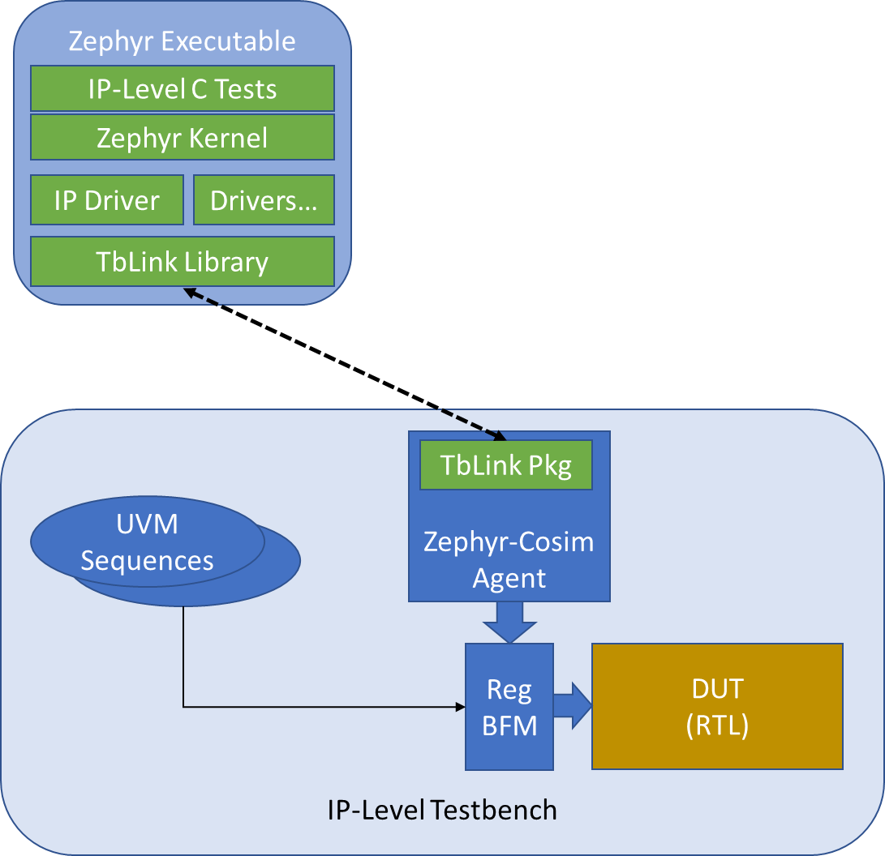
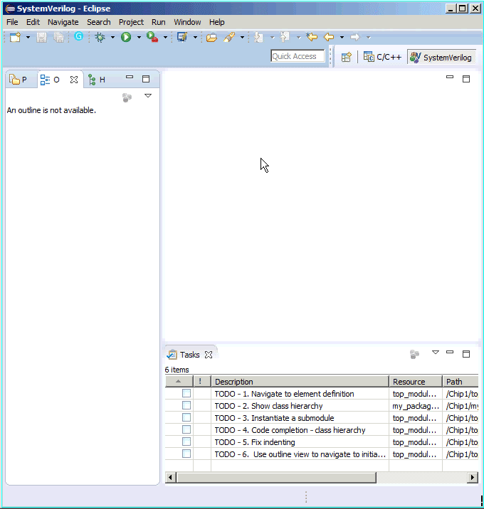

# Open-Source Projects

## Random Generation, Solvers, and Functional Coverage

### PyVSC - Constraints and Coverage in Python

**Stage:** Production

Python has been used for functional verification for quite 
some time. When I began using Python, one thing I missed
from SystemVerilog was access to SystemVerilog-style 
constraints and functional coverage. PyVSC provides a
Python library that supports constrained randomization
and functional coverage collection.

*Note:* PyVSC is used for constraint solving and collecting
functional coverage by the Python implementation of the
Google-developed [RISCV-DV](https://github.com/google/riscv-dv) 
package. RISCV-DV generates random RISC-V test programs.

#### Resources
- [readthedocs](https://pyvsc.readthedocs.io/en/latest/)
- [github](https://github.com/fvutils/pyvsc)
- [WOSET Paper](publications/2020_WOEST_SvStyle_Constraints_Coverage_in_Python.pdf)
- [RISCV-DV](https://github.com/google/riscv-dv)

### PyUCIS

**Stage:** Production

Once collected, functional coverage data must be stored in an accessible
manner to support analysis. [Accellera UCIS](https://www.accellera.org/downloads/standards/ucis)
defines an API for storing and retrieving coverage data, as well as an
XML interchange format. 
PyUCIS is an object-oriented Python API on top of the UCIS API that can 
be used to store and access coverage data. Supported back-end implementations
include commercial tool implementations of the UCIS API, the XML 
interchange format, and an in-memory representation.

#### Resources
- [github](https://github.com/pyucis)
- [Accellera UCIS](https://www.accellera.org/downloads/standards/ucis)

### PyUCIS-Viewer

**Stage:** Beta

Interactive graphical applications make getting an intuitive sense of
coverage data simpler. PyUCIS Viewer is a Python application that 
uses the [QT](https://www.qt.io) library to render coverage data.

#### Resources
- [github](https://github.com/fvutils/pyucis-viewer)

### libvsc

**Stage:** Development

The PyVSC library uses the [Boolector](https://github.com/boolector/boolector)
SMT solver to implement SAT solving. Additional algorithms are needed to
implement iterative constraint (eg foreach) expansion, constraint partitioning, 
and uniform randomization. While Python is great as a front-end interface
for the user, it doesn't excel at high-performance computation.

libvsc is a new C++ implementation of the core data model, 
coverage collection, and randomization algorithms. Early measurements indicate
that libvsc is roughly twice as fast as PyVSC.

#### Resources
- [github](https://github.com/fvutils/libvsc)

## Software-Driven Functional Verification
Software-driven verification, and the techniques surrounding it, 
have been a continuing interest of mine. The projects below help to
make software-driven verification simpler and more productive.

### Bare-Metal Kernel

**Stage:** Alpha/Archived

The goal of bare-metal software is to have maximum control of the
hardware. Bare-metal software still benefits from light-weight
infrastructure and services that help to make test writing more
productive. 
The Bare-Metal Kernel implements multi-core bring-up and threaded
execution environment. Synchronization primitives are provided
that support synchronization across hardware threads and 
cooperatively-scheduled software threads.

The BMK project worked for the use cases it was intended to 
support. However, going forward, I've decided to invest in 
supporting these use cases using the Zephyr RTOS kernel.

#### Resources
- [github](https://github.com/mballance/bmk)

### Zephyr-Cosim

**Stage:** Alpha

A key challenge in SoC integration testing is obtaining 
and integrating driver firmware for use by the integration tests.
The Zephyr-Cosim project helps to address these challenges by making
it easy to develop driver firmware in the context of an IP-level
verification environment. Because the driver firmware is developed
using the Zephyr RTOS driver framework, it integrates easily
with driver firmware for other IPs in the SoC environment.

#### Resources
- [github](https://github.com/zephyr-dv/zephyr-cosim)

### Zephyr DV Patches

**Stage:** Planning

The Zephyr RTOS implementation is tuned for running embedded application
software on resource-constrained hardware platforms. Test software
has similar requirements, but there are also differences. These patches
are intended to better-support software-driven verification in 
simulation and hardware-assisted execution environments.

- **Per-Core Scheduler** -- Zephyr's support for multi-core preemptively 
schedules threads on cores as they become available. This is good for 
application software, but software-driven tests need to take full
control over each core. The per-core scheduler patch will support this
verification-centric scheduler model.
- **Pre-Initialized RAM** -- Zephyr is designed to be run in environments
where code must assume that RAM is uninitialized. In verification 
environments, RAM is often initialized when loading the software image.
Skipping RAM initialization saves a non-insignificant amount of 
simulation time, focusing more simulation time on the actual test.
- **Semi-Host Printk** -- Displaying messages from the running test
is an important debug mechansim. Unfortunately, formatting and displaying 
messages (often via a serial link) is very time-consuming. Especially 
in simulation environments, much of the work of message formatting
and display can be handled by the testbench. This patch will enable
Zephyr to be configured to take advantage of this support.

### Zephyr DTS Tools

**Stage:** Development

The Zephyr RTOS uses the [DeviceTree Specification](https://www.devicetree.org)
to configure the software image. However, the description captured in the 
.dts file can be used in other ways as well. The DTS Tools project
allows users to extract data from a DeviceTree Specification and use it 
to generate artifacts used in the verification environment, documentation, etc.

## Functional Verification Infrastructure

### PyBFMs - Bus-Functional Models for Python

### Resources
- [github](https://github.com/pybfms)

### TbLink RPC

**Stage:** Development

Design verification in simulation is typically performed on
a Verilog, VHDL, or SystemC representation. Connecting to
outside code -- testbench, reference model, checkers, etc --
is a key aspect of a verification environment. Unfortunately,
the integration APIs provided by various simulation environments
are different, and have different capabilities. Furthermore,
some of the code being integrated may support running in a thread,
but might require running as a separate process.

The goal of the TbLink-RPC is to implement a simulation-aware
integration API and code generation that simplifies the process
of connecting a new testbench/checker/etc to a simulation-based
or hardware-assisted verification environment.

#### Resources
- [Introduction](https://tblink-rpc.github.io)
- [github](https://github.com/tblink-rpc)

### IVPM - IP and Verification Package Manager
Design and Verification IP comes from many sources. While it 
would be nice to think of reusable IP as being 'complete' and
'read-only', in practice I often find myself co-developing
projects. IVPM manages fetching project dependencies from a
variety of sources (but with a focus on Git repositories) and
creating a project-local set of package dependencies. 

#### Key Features
- Integration with SVE

#### Resources
- [github](https://github.com/fvutils/ipvm)

### MKDV - Job Runner for Functional Verification

**Stage:** Beta / Internal Production

#### Key Features
- YAML-based specification of job configurations
- Support for running parallel jobs locally or via [Slurm Workload Manager](https://slurm.schedmd.com/documentation.html)
- Integration with [Allure](https://docs.qameta.io/allure/) for reports
- Support for IP packaged using [FuseSoC](https://fusesoc.readthedocs.io) meta-data.

### Resources
- [github](https://github.com/fvutils/mkdv)

## eFabless/Google Multi-Project Wafer (MPW)

**Stage:** Complete (Dec 2020)

Taping out a chip has been a long-term dream of mine, and 
one that seemed unlikely to be realized given the difficulty 
and expense of doing so. A few 
developments in the industry brought this dream within reach. 
First, the [OpenROAD Project](https://theopenroadproject.org/) assembled
an RTL-to-GDS flow using open-source tools. Next, Google partnered with 
[SkyWater Technology](https://www.skywatertechnology.com/) 
to release the CMOS 130nm PDK as open source, and partnered with 
[eFabless](https://efabless.com/) to run a series of 
multi-project wafer (MPW) tape-outs for open-source designs to 
validate the flow.

I participated in the first tapeout with a very simple SoC design. 
The design and testbench environment are shown below.

Learning about the tools and key considerations across the entire
process was extremely educational -- and, self-education process I
would have been unlikely to undertake as a personal project in 
the absence of an open-source toolflow.

### Resources
- [github](https://github.com/mballance/caravel_fwpayload)
- [PR](https://www.businesswire.com/news/home/20210406005366/en/First-Google-Sponsored-MPW-Shuttle-Launched-at-SkyWater-with-40-Open-Source-Community-Submitted-Designs)

## SVEditor - A SystemVerilog Eclipse Plug-in

**Stage:** Production / Archived

In 2008, when I started learning SystemVerilog, I had spent 
several years writing software using the [Eclipse](https://eclipse.org)
integrated development environment.
My experience was that the language-support features Eclipse provided
for Java and C/C++ made me significantly more productive vs using a
plain-text editor like Emacs or Vi, and I found
myself missing that when writing SystemVerilog.

SVEditor indexes a user-specified list of Verilog and SystemVerilog
files, and uses the extracted symbols to support navigation across
the codebase, context-specific content assist, and to automate 
creation of code.

SVEditor is no longer being actively developed, but I continue to
use it almost any time I write Verilog/SystemVerilog code.

### Resources
- [website](https://sites.google.com/site/svedvkit)
- [github](https://github.com/sveditor/sveditor)

